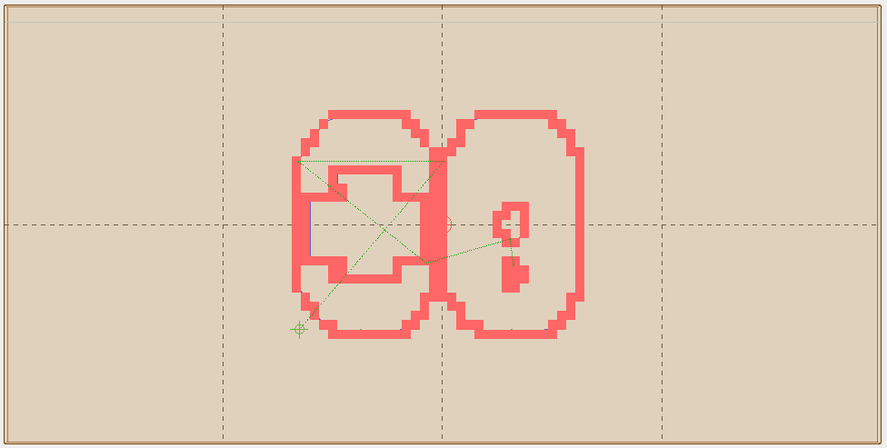
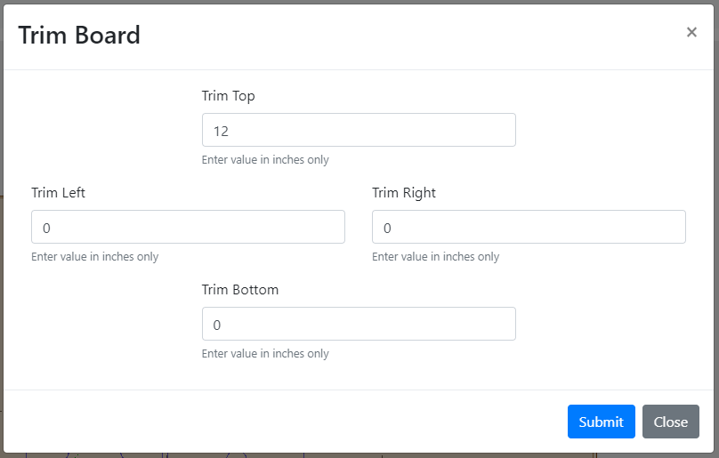

# Board Management

Release: >0.906
{: .label .label-blue }

## Concept

Board management as implemented in WebControl allows the user to track the areas of a given board that have been cut or otherwise marked by executing gcode.  The system tracks cut areas at a 1-inch square resolution.  That is, a standard 4-foot by 8-foot sheet of plywood is tracked by a 48 x 96 grid.

## Functions

### Create/Edit Board

This function allows the user to define the size (width, height, thickness) of a board, provide identifying information (board ID, material type), and the position of center of the board on the frame.

Board Details:
The "Board ID" can be any name or other identifier the user desires to give the board (e.g., Board 1, A1, MDF-1, etc.)  The "Material" can be any description the user desires to enter (e.g, MDF, Plywood, Acrylic, Depleted Uranium, etc.)

Board Dimensions:
The units of the board is based upon the unit setting for the machine.  So if you have it set to metrics, your units will be reported in metric.. if in imperial, they will be reported in imperial.

Board Positions:
Center X (horizontal) and Center Y (vertical) position of the center of the board with respect to the frame.  A 4-foot x 8-foot sheet of plywood perfectly aligned on a 'standard' Maslow would have a Center X and Center Y of 0, 0.

Align Board to Router allows the user to use the router's current position to indicate where the board is located.  For boards that are not full sheet sizes, this makes it easy to align the board for cutting.  For example, if the router is located at 12, 0 (1-foot to the right of center) and the board is perfectly centered under the router bit, pressing the 'Center' button will set the Center X and Center Y of the board to 12, 0.  If, instead, the top right corner of a 1-foot board is located directly under the router bit, pressing 'Top Right' will set the Center X and Center Y of the board to 6, 0 (6-inches to the right of the center).

### Process GCode

The GCode that has been loaded will be used to mark areas on the board that have been cut.  Obviously, this would be performed after you actually perform a cut. 

### Open / Save Board

Allows user to save board data to the drive and open previously saved board data.

### Trim GCode

In the event the user cuts part of the board off (i.e., trims an edge), this function allows for the board data to be updated.  For example, if the user cuts 1-foot off the top of the board, the user can enter 12 under 'Trim Top' and the top 12-inches will be removed from the board data.  Note, this doesn't affect the value of Center X and Center Y.

### Clear Board

Clears all cut information from current board.  
